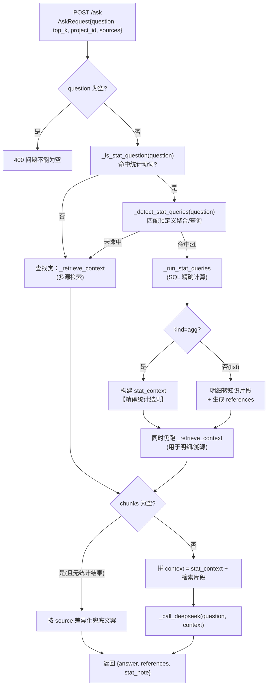
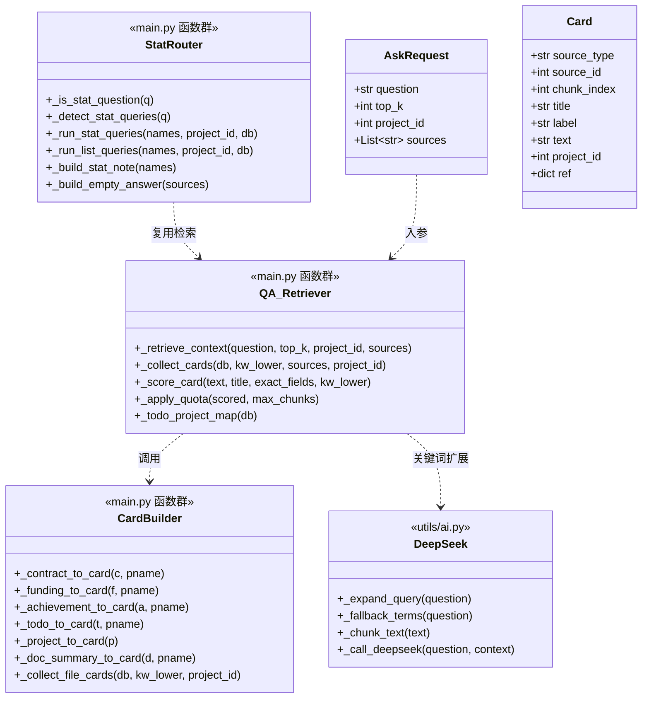
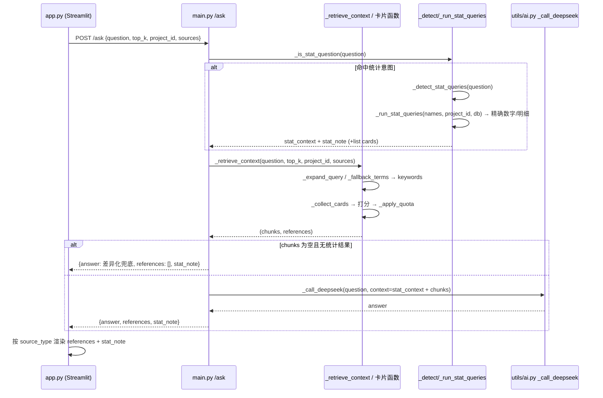

# 智能问答模块增量设计 —— 问答范围扩展至全模块

> 变更对象：`POST /ask` 及其检索/生成链路（`main.py` `_retrieve_context` / `/ask`、`utils/ai.py` `_call_deepseek`、`app.py` `render_ask_page` / `api_ask`）
> 技术栈不变：FastAPI + SQLAlchemy + SQLite + Streamlit + DeepSeek，**不新增依赖**。

---

## 1. 实现方案总览

### 1.1 核心改造

把「单一文件全文检索 → 单次生成」升级为「**多源混合检索 + 统计意图路由 + 单次生成**」三段式管道：

1. **意图判定（零成本规则）**：用关键词规则把问题分成两类——`统计/结构化查询` 与 `查找类`。统计类走预定义 SQL 聚合/查询，得到精确数字/明细；查找类走多源检索。**不额外调用 LLM 做路由**（避免第二次调用带来的延迟与成本，且统计必须确定）。
2. **多源知识片段**：文件仍走 `_chunk_text` 切块；合同/经费/成果/待办/项目/资料摘要等结构化记录各序列化为一条「知识片段」（record card），复用现有关键词词频打分 + 标题命中加成，再按数据源配额公平装配。
3. **生成**：精确统计结果以 `【精确统计结果】` 标记拼入 prompt，检索片段以 `【label】text` 拼入；更新 `_call_deepseek` 的 system prompt，明确「可依据文件资料与结构化台账数据回答，统计数字以系统计算结果为准，不得自行数数/估算」。

### 1.2 意图路由分支流程



---

## 2. 数据源文本化设计

### 2.1 知识片段统一结构（card）

所有数据源（含文件块）统一归一化为：

```python
{
    "source_type": "contract",   # file/contract/funding/achievement/todo/project/document_summary
    "source_id": 123,            # 源内部主键；file 为 ProjectFile.id，document_summary 为其自身 id
    "chunk_index": None,         # 仅 file 源有（第几块），其余为 None，用于去重
    "title": "合同名称/成果名/待办标题/文件名…",  # 用于「标题命中加成」
    "label": "人类可读标题（拼给 LLM 与 references）",
    "text": "文本化内容（结构化记录为一条，不切块）",
    "project_id": 1,
    "project_name": "xx",
    "ref": { ... }               # 对应 references 里的一条（见 §4.4）
}
```

### 2.2 各数据源文本化模板（字段拼接）

> 约定：金额 `_fmt_money`（千分位 + 保留 2 位）；比例 `_fmt_pct`（`ratio*100` 保留 1 位 + `%`）；日期 `_fmt_date`（`_parse_date` 解析成功则规范为 `YYYY-MM-DD`，失败原样）。**空字段整段跳过**。

| source_type | text 模板（空字段跳过） | title 字段 | 数据来源 |
|---|---|---|---|
| `file` | 原文块（`_chunk_text` 输出，不改） | `f.original_name` | ProjectFile + Project |
| `contract` | `【合同】《{contract_name}》编号{contract_no}，甲方{party_a}，乙方{party_b}，合同金额{amount_value}{currency}（含税{amount_incl_tax}，不含税{amount_ex_tax}），类型{contract_type}，签署日期{sign_date}，履约期限{term}，到期日{due_date}，质保金比例{warranty_ratio}，状态{status}，所属项目{project_name}` | `contract_name`（泛化名回退 `original_name`） | Contract + Project |
| `funding` | `【经费】{project_name}，科目{item_name}，类型{fund_type}，金额{amount}元，日期{fund_date}，备注{remark}` | `item_name` | Funding + Project |
| `achievement` | `【成果】{project_name}，名称{name}，类型{category}，状态{status}，权利人{holder}，取得日期{achieve_date}，备注{remark}` | `name` | Achievement + Project |
| `todo` | `【待办】{category}，{title}，级别{level}，详情{detail}，状态{status}，关联模块{link}` | `title` | Todo（project 经映射补入） |
| `project` | `【项目】{name}（编码{code}），当前阶段{stage}，简介{description}` | `name` | Project |
| `document_summary` | `【资料摘要】{doc_type}：{summary}` | `doc_type` | DocumentSummary + Project |

### 2.3 打分（复用词频 + 名称/精确加成）

对每条 card（含文件块）计算：

```python
base        = sum(cnt * max(1.0, len(k) / 2) for k in kw_lower for cnt in [text_lower.count(k)] if cnt > 0)
name_bonus  = sum(max(1, len(k) // 2) for k in kw_lower if k in title_lower) * 3   # 原「文件名命中 *3」推广为「标题命中 *3」
exact_bonus = EXACT_BONUS if any(k in exact_fields for k in kw_lower) else 0       # 精确字段：合同编号/项目 code/成果 name
score       = base + name_bonus + exact_bonus
```

- `EXACT_BONUS = 5.0`（P1 精确匹配优先，落实现有 `R11`）。
- snippet：文件块用现有 `_make_snippet`；结构化卡片文本短，`snippet = text`（整段）。

### 2.4 数据源配额（保底 + 上限，保证公平）

```python
QA_SOURCES = ["file", "contract", "funding", "achievement", "todo", "project", "document_summary"]

SOURCE_QUOTA = {
    "file":              {"min": 4,  "max": 16},   # 文件内部仍沿用「每文件保底 1 块 + 单文件上限 8」
    "contract":          {"min": 2,  "max": 6},
    "funding":           {"min": 1,  "max": 4},
    "achievement":       {"min": 2,  "max": 6},
    "todo":              {"min": 2,  "max": 6},
    "project":           {"min": 1,  "max": 3},
    "document_summary":  {"min": 1,  "max": 4},
}
```

装配顺序（`_apply_quota`）：
1. 每源先按分数降序取 `min` 条**保底**；
2. 剩余名额按**全局分数**填充，每源累计不超过 `max`；
3. 全局不超过 `MAX_CHUNKS = 40`（`top_k` 有值时 `max_chunks = max(1, min(top_k, 40))`）。

### 2.5 DocumentSummary 去重（`R7` 延伸）

`document_summary` 与 `ProjectFile` 全文并存，按「**全文块优先**」去重：装配阶段若某摘要的 `file_id` 与已入选文件块的 `file_id` 相同，丢弃摘要、保留全文块（用 `seen_file_ids` 集合实现）。摘要在全文为空/未命中时兜底提供高信噪比片段。

---

## 3. 统计聚合设计（重点）

### 3.1 决策：预定义查询 + 规则映射（非 LLM 生成 SQL）

- **Open Q1**：采用「**预定义查询函数 + 关键词映射**」。数字由 Python + SQLAlchemy（`func.count` / `func.sum` / 分组）精确计算，LLM 仅组织语言。安全、确定、可解释。
- **Open Q2（意图路由成本）**：采用「**纯规则关键词**」判定，**复用 `_expand_query` 同一次调用**，不再为路由额外调用 DeepSeek。理由：统计必须确定且零额外延迟；`R9` 的「LLM 智能路由」降级为可选优化，本阶段以 `sources` 参数 + 规则替代。
- **Open Q8（口径）**：合同总金额 = `sum(amount_incl_tax or amount_value or 0)`（与 `project_dashboard` 一致，含税优先）；到账经费 = `sum(amount where fund_type='到账')`；结余 = `income - expense`（与 `funding_stats` 一致）；成果/待办计数口径见下表。

### 3.2 预定义查询清单（`_run_stat_queries` 分发）

判定规则：问题命中 `STAT_VERBS` 之一 → 进入 `_detect_stat_queries`；再遍历下表，命中某查询的 `entities`（且必要时 `verbs`）即命中该查询。可一次命中多个（如「合同总数和总金额」→ 同时命中 count + amount）。

```python
STAT_VERBS = ["一共","总共","多少","多少份","多少笔","多少项","合计","总计","求和","总金额",
              "汇总","统计","分布","平均","到账","结余","预算","支出","累计","共有","有几","几个","几份","几笔"]
```

| name | kind | 触发词（entities） | SQL 语义（受 `project_id` 下推过滤） | 口径说明 |
|---|---|---|---|---|
| `contract_count_total` | agg | 合同 | `SELECT COUNT(*) FROM contracts [WHERE project_id=?]` | 合同台账全量（含未确认） |
| `contract_amount_total` | agg | 合同 + 金额/合计/总金额 | `SUM(COALESCE(NULLIF(amount_incl_tax,0), amount_value, 0))` | 含税优先，无含税退回合同金额 |
| `contract_count_by_type` | agg | 合同 + 类型/分布 | `GROUP BY contract_type` | 未分类归「未分类」 |
| `contract_count_by_status` | agg | 合同 + 状态/超期/临期 | 复用 `_contract_status(due_date)` 分组 | 已超期/即将到期/正常 |
| `funding_income` | agg | 经费/资金 + 到账 | `SUM(amount) WHERE fund_type='到账'` | 与 `funding_stats.income` 一致 |
| `funding_budget` | agg | 经费 + 预算 | `SUM(amount) WHERE fund_type='预算'` | |
| `funding_expense` | agg | 经费 + 支出 | `SUM(amount) WHERE fund_type='支出'` | |
| `funding_balance` | agg | 经费 + 结余 | `income - expense` | 与 `funding_stats.balance` 一致 |
| `funding_by_type` | agg | 经费 + 分布/类型 | `GROUP BY fund_type` | |
| `achievement_count_by_status` | agg | 成果/专利/论文 + 数量/状态 | `GROUP BY status [WHERE category=?]` | 专利等可按 category 二次过滤 |
| `achievement_count_by_category` | agg | 成果 + 类型/分布 | `GROUP BY category` | |
| `achievement_authorized` | list | 成果/专利 + 已授权 | `WHERE status='已授权' [AND category='专利'] ORDER BY achieve_date DESC` | 返回明细 → 转片段 + references |
| `todo_unhandled_count` | agg | 待办 + 未处理/数量 | `COUNT(*) WHERE status='未处理'` | |
| `todo_recent` | list | 待办 + 最近 | `ORDER BY created_at DESC LIMIT N`（N=10） | 返回明细 → 转片段 + references |

> 「项目阶段」「合同甲方」等**精确字段查找**不建聚合，直接走检索（project/contract card 文本已含 `stage`/`party_a`，能命中「俄公堡」+「甲方」）。

### 3.3 聚合结果拼入 prompt

`/ask` 中：

```python
stat_context = ""
stat_note = ""
agg_results = _run_stat_queries(agg_names, project_id, db)   # agg 部分
if agg_results:
    stat_context = "【精确统计结果】\n" + json.dumps(agg_results, ensure_ascii=False)
    stat_note = _build_stat_note(agg_names)                  # 如「合同总金额 = 已确认/全部合同含税金额求和，共 N 份」
# list 部分：明细转 card，merge 进检索 chunks/references
```

最终 `context = stat_context + "\n\n---\n\n" + "\n\n".join(f"【{c['label']}】\n{c['text']}" for c in chunks)`。

`_call_deepseek` 的 system prompt 追加一条（见 §4.5）：当出现 `【精确统计结果】` 时**直接引用、不得重新计算/数数/估算**。

### 3.4 空结果兜底文案（`R10`）

按 `sources`（或实际数据源）区分：结构源无数据 → 「合同模块暂无数据，请先录入合同」等；全部无内容 → 保留原「资料中没有找到相关内容」并附建议。

---

## 4. 接口与数据结构

### 4.1 `AskRequest` 扩展（main.py:234）

```python
class AskRequest(BaseModel):
    question: str
    top_k: int = 5
    project_id: Optional[int] = None
    sources: Optional[List[str]] = None   # None/[] 表示全部；元素∈QA_SOURCES，非法值忽略并落到「全部」
```

### 4.2 `_retrieve_context` 签名变化（main.py:63）

```python
def _retrieve_context(question, top_k=5, project_id=None, sources=None):
    """多源混合检索。sources 为空/None 时检索全部 QA_SOURCES。
    返回 (chunks, references)；chunks 为 card 列表，references 为统一结构列表。"""
```

内部流程：
1. `keywords = _expand_query(question)` 失败退回 `_fallback_terms`；
2. `cards = _collect_cards(db, kw_lower, sources, project_id)`（各源收集 + 打分 + file 内部每文件配额）；
3. `scored = sorted(cards, key=score, reverse=True)`；
4. `chosen = _apply_quota(scored, max_chunks)`；
5. 拆出 `chunks`（label/text）与 `references`（card.ref），DocumentSummary 按 `seen_file_ids` 去重。

### 4.3 新增辅助函数清单（全部放 main.py，紧邻 `_retrieve_context`，约 main.py:60-180）

| 函数 | 职责 |
|---|---|
| `_fmt_money(v)` / `_fmt_pct(v)` / `_fmt_date(s)` | 金额/比例/日期规范化 |
| `_contract_to_card(c, pname)` | Contract → card |
| `_funding_to_card(f, pname)` | Funding → card |
| `_achievement_to_card(a, pname)` | Achievement → card |
| `_todo_to_card(t, pname)` | Todo → card |
| `_project_to_card(p)` | Project → card |
| `_doc_summary_to_card(d, pname)` | DocumentSummary → card |
| `_collect_file_cards(db, kw_lower, project_id)` | 文件全文切块 + 打分 + 每文件保底/上限（复用原逻辑） |
| `_collect_cards(db, kw_lower, sources, project_id)` | 按 sources 汇总各源 cards |
| `_score_card(text, title, exact_fields, kw_lower)` | 单卡片打分 |
| `_apply_quota(scored, max_chunks)` | 按 SOURCE_QUOTA 装配 + 去重 |
| `_todo_project_map(db)` | `_generate_todo_items(db)` → `{(category,source_id): project_id}`，供待办单项目过滤 |
| `_is_stat_question(q)` | 规则判定是否统计意图 |
| `_detect_stat_queries(q)` | 返回命中的查询名列表 |
| `_run_stat_queries(names, project_id, db)` | 执行聚合（agg），返回精确结果 dict |
| `_run_list_queries(names, project_id, db)` | 执行明细查询（list），返回 card 列表 |
| `_build_stat_note(names)` | 生成统计口径文案 |
| `_build_empty_answer(sources)` | 差异化兜底文案 |

### 4.4 references 新结构

```python
{
    "source_type": "contract",       # 必填
    "source_id": 123,
    "label": "合同《xxx》（编号yyy，项目：zzz）",
    "project_id": 1,
    "project_name": "zzz",
    "download_url": "/contracts/123/download",   # 可空
    "jump_url": "?page=contracts&id=123",        # 可空（前端内部跳转）
    "snippet": "命中片段",
}
```

各源 `download_url` / `jump_url`：

| source_type | download_url | jump_url |
|---|---|---|
| file | `/files/{id}/download` | `?page=files` |
| document_summary | `/files/{file_id}/download` | `?page=files` |
| contract | `/contracts/{id}/download` | `?page=contracts&id={id}` |
| funding | — | `?page=funding` |
| achievement | `/achievements/{id}/download`（有 `file_path` 时） | `?page=achievements&id={id}` |
| todo | — | `?page=todos`（可带 `id`） |
| project | — | `?page=projects&id={id}` |

### 4.5 `_call_deepseek` prompt 更新（utils/ai.py:88）

system prompt 首句改为「你是研发知识库的专业研究助手，擅长从**文件资料与结构化台账（合同、经费、成果、待办、项目信息、资料摘要）**中提炼、归纳和综合信息」，并在要求末尾新增：

```
6. 当上下文中出现【精确统计结果】标记时，说明这些数字已由系统精确计算，请直接引用，不要自行重新计算、数数或估算；涉及统计请注明统计口径。
```

`max_tokens=8100` 保持不变。

### 4.6 `/ask` 返回体扩展（main.py:681-704）

```python
return {"answer": answer, "references": references, "stat_note": stat_note}
```

---

## 5. 前端改动（app.py）

### 5.1 `api_ask` 加 `sources` 参数（app.py:1071）

```python
def api_ask(question, top_k=40, project_id=None, sources=None):
    json={"question": question, "top_k": top_k, "project_id": project_id}
    if sources:
        json["sources"] = sources
    resp = requests.post(f"{API_BASE}/ask", json=json, timeout=300)
```

### 5.2 范围多选控件 + 收敛分支（`render_ask_page` app.py:1099）

在「选择要提问的项目」下拉下方新增：

```python
QA_SOURCE_OPTIONS = {"📚 资料": "file", "📄 合同": "contract", "💰 经费": "funding",
                     "🏆 成果": "achievement", "✅ 待办": "todo", "📁 项目信息": "project"}
# 默认全选
selected_labels = st.multiselect("问答范围", list(QA_SOURCE_OPTIONS.keys()),
                                 default=list(QA_SOURCE_OPTIONS.keys()))
auto_scope = st.toggle("智能自动判断范围", value=True)   # 开启时忽略手动多选，由后端默认全部
sources = None if auto_scope else [QA_SOURCE_OPTIONS[l] for l in selected_labels]
```

**收敛分支（Open Q6）**：删除 `is_doc → api_documents_summarize`、`is_stats → api_project_stats` 两分支（app.py:1136-1146），统一走：

```python
resp = api_ask(q, top_k=40, project_id=selected_project_id, sources=sources)
```

（后端 `api_documents_summarize` / `api_project_stats` 接口保留不动，仅供其他页面/向后兼容。）

### 5.3 references 按 `source_type` 分支渲染（app.py:1169-1185）

```python
ICON = {"file":"📄","document_summary":"📄","contract":"📄","funding":"💰",
        "achievement":"🏆","todo":"✅","project":"📁"}
for ref in item["references"]:
    stype = ref.get("source_type", "file")
    label = ref.get("label") or ref.get("original_name", "未命名")
    dl = ref.get("download_url", "")
    jump = ref.get("jump_url", "")
    line = f"- {ICON.get(stype,'📄')} **{label}**"
    if stype in ("contract","achievement","file","document_summary") and dl:
        tok = st.session_state.get("token", "")
        line += f"　[⬇️ 下载]({API_BASE}{dl}?token={tok})"
    if jump:
        line += f"　[🔗 查看]({jump})"
    st.markdown(line)
    if ref.get("snippet"):
        st.caption(f"　　片段：{ref['snippet']}")
```

### 5.4 统计口径小字

`data.get("stat_note")` 非空时，在 answer 下方渲染 `st.caption(f"📐 统计口径：{stat_note}")`。

---

## 6. 任务列表（按实现顺序）

> 说明：任务分解的「每任务≥3 文件、首任务=基础设施」规则面向全量新建项目；本次为**增量改造，仅触碰 3 个文件**，故按功能模块分组，任务间依赖尽量线性短。

| Task | 名称 | 改哪个文件/哪段 | 做什么 | 依赖 | 验收点 |
|---|---|---|---|---|---|
| **T01** | 多源检索管道（后端核心） | `main.py`：`_retrieve_context`(63-176) 重写；新增 `QA_SOURCES`/`SOURCE_QUOTA` 常量、`_fmt_*`、`_*_to_card`、`_score_card`、`_collect_cards`、`_collect_file_cards`、`_apply_quota`、`_todo_project_map` | 结构化记录文本化、统一打分、配额装配、`project_id`/`sources` 下推 | — | 传入 `sources`/`project_id` 能返回带 `source_type` 的 chunks+references；纯文件检索回归不变 |
| **T02** | 统计意图路由 + 聚合 + `/ask` 改造 | `main.py`：`AskRequest`(234)、`/ask`(681-704)、新增 `_is_stat_question`/`_detect_stat_queries`/`_run_stat_queries`/`_run_list_queries`/`_build_stat_note`/`_build_empty_answer`；`utils/ai.py`：`_call_deepseek`(88-120) prompt | 意图判定、SQL 聚合、精确结果拼 prompt、返回 `stat_note`、兜底文案 | T01 | 「一共多少合同/总金额」「到账经费」返回精确数字 + 口径；查找类不受影响 |
| **T03** | 前端接口与范围控件 | `app.py`：`api_ask`(1071)、`render_ask_page`(1099-1146) 控件 + 分支收敛 | `api_ask` 加 `sources`；新增 multiselect/toggle；删除 is_doc/is_stats 分支统一走 `/ask` | T02 | 范围控件默认全选、可限定；请求带正确 `sources`；回归单项目问答 |
| **T04** | references 分源渲染 + 口径展示 + 联调 | `app.py`：`render_ask_page`(1169-1185) references 渲染、`stat_note` 小字 | 按 `source_type` 图标 + ⬇️下载 / 🔗查看；统计口径小字 | T03 | 结构化引用正确跳转/下载；统计回答底部口径正确；PRD 5 类验收问题全部通过 |

---

## 7. 依赖包

**无需新增**。现有 `SQLAlchemy`（`func.count/sum`、group_by）、`requests`、`streamlit`（`st.multiselect` / `st.toggle` 内置）即可覆盖。

---

## 8. 共享约定

- 数据源枚举字符串统一小写：`file / contract / funding / achievement / todo / project / document_summary`。
- 后端常量 `QA_SOURCES`、`SOURCE_QUOTA` 定义在 main.py 顶部（`MAX_CHUNKS`/`PER_FILE_CHUNKS` 附近）；前端 `QA_SOURCE_OPTIONS`（label→source）与 `ICON` 在 app.py 顶部镜像定义，**不跨端 import**（前后端分离部署）。
- references 统一字段：`source_type / source_id / label / project_id / project_name / download_url / jump_url / snippet`。
- 金额 `round(x, 2)` + 千分位；比例 `ratio*100` 保留 1 位；日期经 `_parse_date` 规范为 `YYYY-MM-DD`，失败原样。
- 命名：卡片函数 `_<source>_to_card`；统计查询函数 `_qa_*` 或经 `_run_stat_queries` 分发；纯函数 `_score_card` / `_apply_quota`。
- 日志沿用 `logger.info("[问答] …")`；审计沿用现有 `_audit`（中间件已覆盖 `/ask`）。
- `top_k` 后端统一 clamp 到 `[1, 40]`（`MAX_CHUNKS=40`）。

---

## 9. 待明确事项（需主理人/用户拍板）

1. **合同总金额口径**：本设计采用 `sum(amount_incl_tax or amount_value or 0)`（与项目 dashboard 一致），但 `/contracts/stats` 用的是 `amount_value`；建议统一为「含税优先」，需确认。
2. **前端跳转实现范围**：`jump_url`（`?page=contracts` 等）依赖 Streamlit 单页导航机制。若当前 app 主入口尚无 `st.query_params` 监听，需在 T04 一并加一个轻量导航分发；确认该工作是否纳入本次范围。
3. **待办单项目过滤**：Todo 无 `project_id` 字段，本设计经 `_generate_todo_items` 反查 project_id；合同未关联项目的待办在单项目下不显示（project_id=None）。此行为是否接受。
4. **统计回答是否仍附检索 references**：本设计默认统计类仍返回检索片段作溯源/明细；若希望纯统计只返回数字+口径（不带 references），可配置，请确认。

---

## 附：类结构图（数据/函数关系）



## 附：主流程时序图



---

架构设计完成，交由工程师实现
