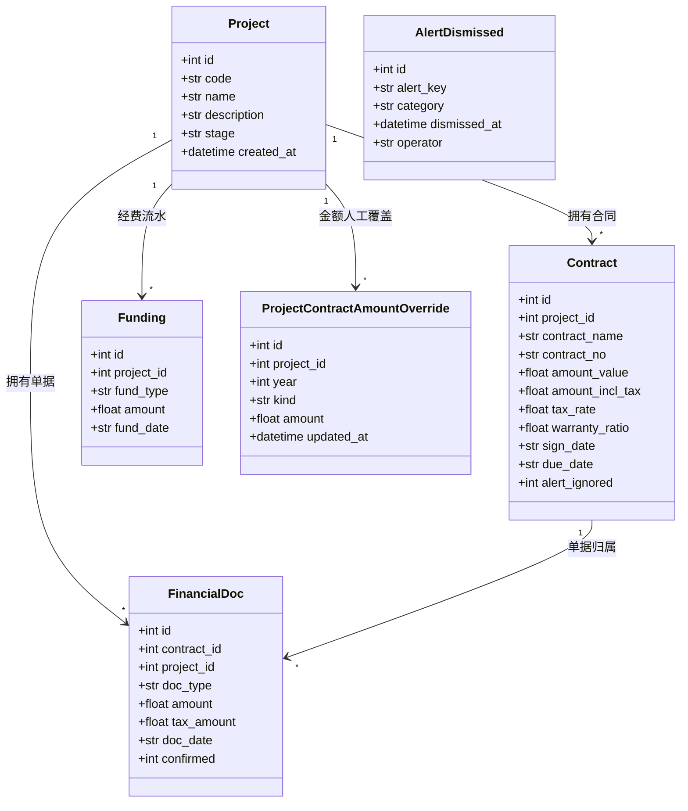
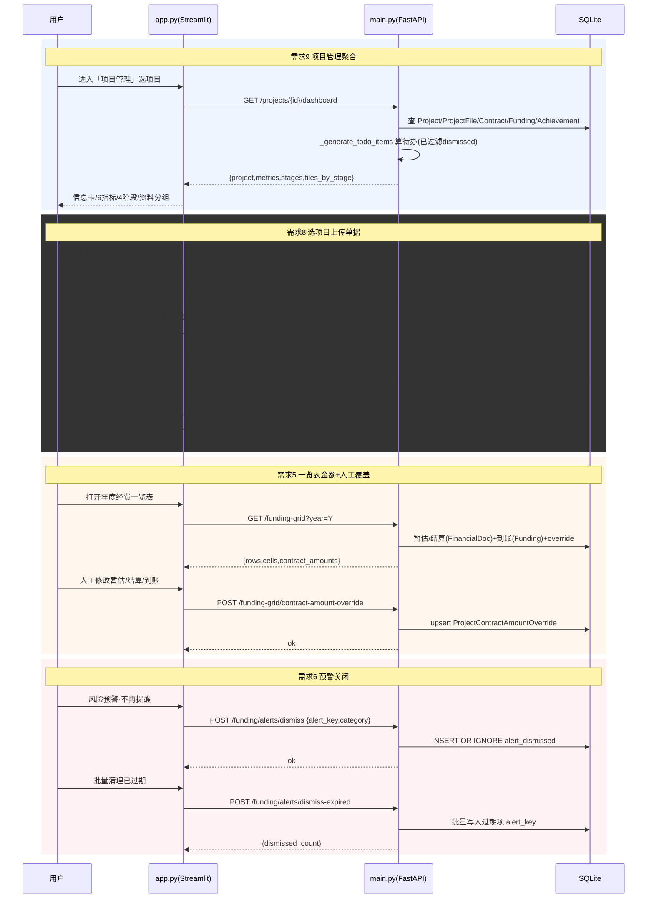
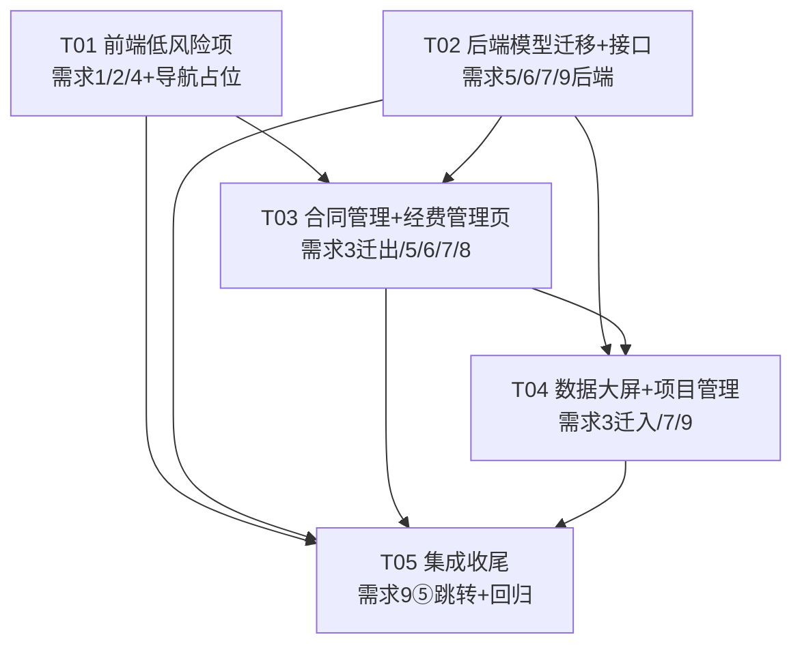

# 研发知识智能管理平台 · 增量系统设计与任务分解

> 架构师：高见远（Bob） · 日期：2026-10-06
> 输入：9 条增量需求（口径已由主理人拍板，设计阶段不再改动）
> 代码基线：`main.py`（FastAPI + SQLAlchemy + SQLite，5231 行）、`app.py`（Streamlit，2909 行）

---

## 一、实现方案与技术选型

### 1.1 技术难点与应对

| 难点 | 应对 |
|------|------|
| SQLite 旧库平滑升级（Project 缺 `stage`） | 沿用现有 `inspect + ALTER TABLE ADD COLUMN` 迁移模式（main.py 已有先例），`create_all` 负责新建两张新表 |
| 年度一览表金额口径复杂（暂估/结算/到账 + 人工覆盖） | 新增轻量表 `project_contract_amount_override`，聚合接口「override 优先于自动值」 |
| 风险预警需持久化「已关闭」且不影响待办角标 | 新增 `alert_dismissed` 表，把关闭过滤下沉到 `_generate_todo_items`（单一事实源），预警/待办/角标三处自动一致 |
| 项目管理一屏聚合 6 类指标 | 新增 `GET /projects/{id}/dashboard` 聚合接口，复用 `_generate_todo_items` 计算待办、`ProjectFile.stage` 统计阶段资料数 |
| 图表集中大屏 + 全局时段筛选 | 后端给统计接口加可选 `start/end/date_field` 参数（改动小），前端抽 `ui_common.time_filter_widget` 组件统一生成快捷时段 |

### 1.2 是否新增依赖

**不新增任何第三方依赖。** 所有需求均可用现有依赖实现：
- 后端：FastAPI + SQLAlchemy + SQLite（`ALTER TABLE`/`create_all`）。
- 前端：Streamlit（`st.dataframe(on_select=..., selection_mode="single-row")`、`st.tabs`、`st.multiselect`）+ pandas + altair（`st.bar_chart`）。

仅新增两个**项目内**轻量模块，不改第三方依赖：
- `constants.py`：共享常量（阶段枚举、金额口径 kind、标签映射）。
- `ui_common.py`：前端纯函数组件（时段筛选组件、金额格式化、阶段进度渲染辅助）。

### 1.3 架构模式

维持现有「Streamlit 单页前端 + FastAPI 单文件后端 + SQLite」结构不变，不引入新的分层框架。增量改动遵循现有代码风格：
- 后端沿用 `@app.get/post` 路由 + Pydantic 请求体 + `Depends(get_db)` + 模块内 `_xxx_to_dict` 序列化。
- 前端沿用 `api_xxx()` 客户端函数 + `render_xxx` 页面函数 + `NAV_OPTIONS` 导航分发。

---

## 二、数据库变更清单（SQLite，兼容旧库）

### 2.1 新增字段

| 表 | 字段 | 类型 | 说明 | 迁移方式 |
|----|------|------|------|----------|
| `projects` | `stage` | VARCHAR(20) | 当前阶段，枚举见 §9 | 启动时 `inspect` 判断，缺失则 `ALTER TABLE projects ADD COLUMN stage VARCHAR(20)`；旧数据默认 `"项目立项"`（聚合接口对空值兜底） |

### 2.2 新增表

**表 A：`project_contract_amount_override`（需求 5，金额人工覆盖）**

| 字段 | 类型 | 说明 |
|------|------|------|
| id | INTEGER PK | |
| project_id | INTEGER | 关联项目 |
| year | INTEGER | 年度 |
| kind | VARCHAR(20) | `estimate` 合同暂估额 / `settlement` 合同结算金额 / `income` 实际到账流水 |
| amount | FLOAT | 人工填写的金额（元） |
| updated_at | DATETIME | 修改时间 |

- 唯一约束：`(project_id, year, kind)` 唯一（写入用 upsert）。
- 语义：一览表/聚合接口中，若存在对应 `(project_id, year, kind)` 记录，则 **override 优先于自动值**；删除记录即恢复自动值。

**表 B：`alert_dismissed`（需求 6，预警关闭）**

| 字段 | 类型 | 说明 |
|------|------|------|
| id | INTEGER PK | |
| alert_key | VARCHAR(120) | 稳定键，格式 `"{category}|{source_id}"`（与 `_sync_todos` 键一致） |
| category | VARCHAR(30) | 预警分类（合同超期/合同临期/逾期付款/节点待办/质保金到期/延期/超额） |
| dismissed_at | DATETIME | 关闭时间 |
| operator | VARCHAR | 操作人（默认 `admin`） |

- 唯一约束：`alert_key` 唯一（`INSERT OR IGNORE` 幂等）。

### 2.3 迁移代码落点

在 `main.py` 第 480 行 `Base.metadata.create_all` 之后的迁移区新增（沿用现有 `_inspector` 模式）：

```python
# 兼容旧库：projects 增加 stage
if "projects" in _inspector.get_table_names():
    _pcols = [c["name"] for c in _inspector.get_columns("projects")]
    if "stage" not in _pcols:
        with engine.begin() as _conn:
            _conn.execute(text("ALTER TABLE projects ADD COLUMN stage VARCHAR(20)"))
        print("[迁移] 已为 projects 表添加 stage 列")
```

新表 `project_contract_amount_override`、`alert_dismissed` 由 `Base.metadata.create_all(bind=engine)` 自动创建（在模型类定义后、`create_all` 之前声明即可）。

---

## 三、接口清单（新增 / 修改）

### 3.1 新增接口

#### ① `GET /projects/{project_id}/dashboard`（需求 9）

- **入参**：路径参数 `project_id`
- **出参**：
```json
{
  "project": {"id":1,"code":"P001","name":"...","description":"...","stage":"项目实施","created_at":"..."},
  "metrics": {
    "file_count": 12,
    "contract_count": 3,
    "contract_total_amount": 1234567.89,
    "funding_income": 800000.0,
    "achievement_count": 5,
    "todo_count": 2
  },
  "stages": [
    {"stage":"项目立项","file_count":4},
    {"stage":"项目投决","file_count":3},
    {"stage":"项目实施","file_count":3},
    {"stage":"项目验收","file_count":2}
  ],
  "files_by_stage": [
    {"stage":"项目立项","files":[{"id":1,"original_name":"...","category":"资料","doc_type":"科技项目申请书","ai_summary":"...","processing_status":"done","uploaded_at":"..."}]},
    {"stage":"未划分","files":[...]}
  ]
}
```
- **聚合逻辑要点**：
  - `file_count` = `ProjectFile` 按 `project_id` 计数。
  - `contract_count` / `contract_total_amount` = `Contract` 按 `project_id` 计数 / `sum(amount_incl_tax or amount_value)`。
  - `funding_income`（经费投入）= `Funding` 中 `fund_type=="到账"` 的 `amount` 求和（口径见 §9）。
  - `achievement_count` = `Achievement` 按 `project_id` 计数。
  - `todo_count` = `_generate_todo_items(db)` 结果中 `it["project_id"] == project_id` 的条数（复用已过滤 dismissed 的结果）。
  - `stages` = 固定四阶段 `PROJECT_STAGES` 各自 `ProjectFile.stage` 计数（缺失/空归「未划分」）。
  - `files_by_stage` = 按 `ProjectFile.stage` 分组，字段取 `original_name/category/doc_type/ai_summary/processing_status/uploaded_at`。
  - `project.stage` 为空时前端兜底显示「项目立项」。

#### ② `POST /funding-grid/contract-amount-override`（需求 5，人工修改金额）

- **入参**（JSON）：
```json
{"project_id":1, "year":2026, "kind":"estimate", "amount":12345.67}
```
- **行为**：
  - `amount` 为 `null` → 删除 `(project_id, year, kind)` 记录（恢复自动值）。
  - 否则 upsert 该记录，`updated_at=now`。
- **出参**：`{"message":"已保存"}`

#### ③ `POST /funding/alerts/dismiss`（需求 6，单条关闭）

- **入参**：`{"alert_key":"合同超期|12", "category":"合同超期"}`
- **行为**：`INSERT OR IGNORE` 写入 `alert_dismissed`。
- **出参**：`{"message":"已不再提醒"}`

#### ④ `POST /funding/alerts/dismiss-expired`（需求 6，批量清理已过期）

- **入参**：无
- **行为**：取 `_generate_todo_items(db)`（已过滤 dismissed），筛出 `alert_date` 非空且 `< date.today()` 的项，逐条 `INSERT OR IGNORE` 写入 `alert_dismissed`。
- **出参**：`{"dismissed_count": 5}`

### 3.2 修改接口

#### ⑤ `GET /funding-grid?year=`（需求 5，扩展返回）

在原返回基础上新增 `contract_amounts`：

```json
"contract_amounts": {
  "1": {
    "estimate": 100000.0, "estimate_override": false,
    "settlement": 80000.0,  "settlement_override": true,
    "income": 90000.0,      "income_override": false,
    "contracts": [
      {"id":10,"contract_name":"...","contract_no":"...","amount_incl_tax":120000.0,
       "sign_date":"2026-01-01","estimate":100000.0,"settlement":80000.0}
    ]
  }
}
```
- **口径**（按 `project_id × year`，年度取自单据日期所在年）：
  - `estimate` = `FinancialDoc(doc_type='暂估单', confirmed=1, doc_date 年==year)` 的 `amount` 求和。
  - `settlement` = `FinancialDoc(doc_type='结算单', confirmed=1, doc_date 年==year)` 的 `amount` 求和。
  - `income` = `Funding(fund_type='到账', project_id, fund_date 年==year)` 的 `amount` 求和。
  - 三者均「override 优先于自动值」；`xxx_override` 标记是否被人工覆盖。
  - `contracts` = 该项目全部合同，每条的 `estimate/settlement` 为该年度该合同内的金额（供前端展开「合同清单」）。
- **年度归属**：`doc_date` / `fund_date` 用 `_parse_date` 解析；解析失败或为空则不归入该年。

#### ⑥ `GET /contracts/stats`（需求 7，时间筛选）

新增查询参数 `start`、`end`、`date_field`（`"sign_date"` 默认 / `"due_date"`）。
- 过滤规则：对每份合同，取 `date_field` 对应字段，用 `_date_in_range(date_str, start, end)` 判断（空值不命中带筛选的查询；无 `start/end` 时全量）。
- 过滤后按原逻辑计算 `total_count/total_amount/by_type/by_status/by_party_a/overdue/upcoming/items`。

#### ⑦ `GET /funding/budget`（需求 7，时间筛选）

新增查询参数 `start`、`end`：
- `by_month/by_quarter/by_year` 统计的 `FinancialDoc`（`confirmed==1`）按 `doc_date` 过滤到 `[start,end]`。
- 其余（下月/下季度预计付款）不受影响。

#### ⑧ `GET /fundings/stats`（需求 7，时间筛选）

新增查询参数 `start`、`end`：`Funding` 按 `fund_date` 过滤到 `[start,end]`。

#### ⑨ `POST /projects` / `PUT /projects/{id}`（需求 9，支持 stage）

- `ProjectCreate` 增加 `stage: Optional[str] = "项目立项"`（校验枚举，非法回退「项目立项」）。
- `ProjectUpdate` 增加 `stage: Optional[str]`（校验枚举）。

#### ⑩ `_generate_todo_items`（需求 6，内部改造）

- 每条提醒新增两个字段：`alert_key`（`f"{category}|{source_id}"`）、`alert_date`（提醒锚定日期，用于「已过期」判断）。
  - 合同超期/临期 → `due_date`；逾期付款/节点待办 → `planned_date`；质保金到期 → `warranty_due_date`；延期 → 合同 `due_date`；超额 → `None`。
- 函数末尾统一过滤：`alert_key in alert_dismissed` 的项不再返回。
- `_sync_todos` 改用 `it["alert_key"]` 作为幂等键（与现状等价），从而关闭预警后待办角标自动不再计数。

---

## 四、前端改动清单（按模块）

### 4.1 合同管理 `render_contract_page`（app.py:1119）

- **需求 1（补列）**：合同明细表（app.py:1303-1326）`rows.append` 增加 3 列：
  - `税率`：`f"{(c.get('tax_rate') or 0)*100:.1f}%"`
  - `含税金额`：`c.get('amount_incl_tax') or 0`
  - `质保金比例`：`f"{(c.get('warranty_ratio') or 0)*100:.1f}%"`
- **需求 2（行跳转）**：明细 `st.dataframe`（1326）改为：
  ```python
  evt = st.dataframe(df, use_container_width=True, hide_index=True,
                     on_select="rerun", selection_mode="single-row", key="contract_table")
  ```
  若 `evt.selection.rows` 非空 → `row_idx = evt.selection.rows[0]` → `sel_id = items[row_idx]["id"]` → `st.session_state["contract_select"] = names[names.index(匹配id的label)]`，并 `st.rerun()`；`selectbox`（1334）仍保留作为兜底（`key="contract_select"` 自动跟随 session_state）。
- **需求 3（图表迁出）**：删除「📊 宏观概览」整段（1270-1299），保留 KPI、超期/临期提醒、明细、详情、查重。
- **需求 7（时间筛选）**：在 KPI 上方加：
  - `st.radio("时间维度", ["签订日期","到期日"], horizontal=True, key="contract_date_dim")`
  - `start, end = time_filter_widget("contract", ...)`（来自 ui_common）
  - `stats = api_contract_stats(start, end, date_field=("sign_date" if 签订日期 else "due_date"))`
  - KPI/提醒/明细均基于过滤后的 `stats`。
- **需求 8（合同详情财务展示）**：在「金额拆分与质保金」（1360-1369）之后加「💵 财务执行（暂估/结算/发票）」块：
  - `cmp = api_funding_compare(c["project_id"])`，从 `cmp["contracts"]` 找 `id == c["id"]` 的条目 `fc`。
  - 4 个 metric：暂估 `fc["estimate_total"]`、结算 `fc["settlement_total"]`、发票 `fc["invoice_total"]`、最终 `fc["effective_total"]`。
  - 差异 `fc["diff_vs_contract"]`；超额判断：`diff_vs_contract > 0`（容忍比例按 `cmp["config"]["overrun_tolerance"]`）→ `st.error("超额")` 否则 `st.success("未超额")`。

### 4.2 经费管理 `render_funding_page`（app.py:1896）

- **需求 4（一览表前置）**：把「年度选择（2101-2104）→ 新增项目行（2114-2141）→ 全周期总览（2144-2163）→ 矩阵一览表（2165-2194）→ 单元格录入（2198-2253）→ 项目行管理（2256-2282）」整块上移到页面最顶部（`st.header` 之后），位于「经费口径配置」之前。纯顺序调整，逻辑不动。
- **需求 3（图表迁出）**：删除「💡 预算与统计」expander（2067-2094）。
- **需求 5（一览表附合同金额）**：在「年度经费一览表」矩阵之后/之内，对每个项目（`rows`）渲染「合同金额」两行：
  - 行 1「合同暂估额」：`contract_amounts[pid]["estimate"]`，附「✏️ 修改」按钮 → 表单录入 → `api_save_contract_amount_override(pid, year, "estimate", amount)`。
  - 行 2「实际入账额」：同时显示两个数 `合同结算金额 settlement` + `实际到账流水 income`，各一个修改按钮。
  - 每个项目一个 `st.expander("合同清单")`，展示 `contracts` 列表（名称/编号/含税金额/签订日期/本年暂估/本年结算）。
  - 被覆盖的字段用 `*(已人工修改)*` 标记。
- **需求 6（预警可取消）**：风险预警区（2049-2065）每条加「🔕 不再提醒」按钮 → `api_dismiss_alert(a["alert_key"], a["category"])`；区块顶部加「🧹 批量清理已过期提醒」按钮 → `api_dismiss_expired_alert()`。
- **需求 8（上传单据联动）**：财务资料上传（1999-2016）改为上传方式切换：
  - `mode = st.radio("上传方式", ["按项目上传（推荐）","按合同上传"], horizontal=True)`
  - **按项目上传**：`st.selectbox("选择项目")` → 该项目合同 `st.multiselect("关联合同（默认全选）", 该项目合同, default=全部)`；上传文件后按「文件名包含合同名/编号关键字」匹配到具体合同（未命中→第一个选中合同），按合同分组多次调用 `api_upload_financial_docs(contract_id, doc_type, project_id, 分组文件)`。
  - **按合同上传**：维持现状（选合同 → 上传）。

### 4.3 数据大屏（app.py:2851）

- **需求 3（图表迁入）**：保留顶部 6 个宏观 KPI + 文件/成果图表；其下改为 `st.tabs(["📑 合同总览", "💰 经费总览"])`：
  - 合同总览：时段筛选组件 + 合同 KPI（总数/总金额/超期/临期）+ 图表（状态 donut、类型份数、类型金额、甲方金额），数据来自 `api_contract_stats(start, end, "sign_date")`。
  - 经费总览：时段筛选组件 + 经费 KPI（预算/到账/支出/结余）+ 图表（下月/下季度预计付款 + by_month/by_quarter/by_year/by_project/by_party），数据来自 `api_funding_budget(start, end)` + `api_funding_stats(start, end)`。
- **需求 7（大屏时段筛选）**：两个 tab 各自嵌入 `time_filter_widget(...)`，生成 `start/end` 传给上述接口。

### 4.4 项目管理（新页面）+ 导航

- **需求 9**：`NAV_OPTIONS`（app.py:1551）在「📁 文件管理」与「📑 合同管理」之间插入 `"📌 项目管理"`。
- 新增 `elif menu == "📌 项目管理":` 分支：
  - `st.selectbox("选择项目", ...)`（支持 `current_project_id` 预选）。
  - `d = api_project_dashboard(project_id)`。
  - ① 信息卡：名称/编号/描述/当前阶段（`project.stage`）/创建时间。
  - ② 6 指标：文件数/合同数/合同总金额/经费投入/成果数/待办数（`st.metric`）。
  - ③ 4 阶段进度条：`PROJECT_STAGES` 顺序渲染 4 步，当前阶段高亮，每步显示该阶段资料数（`stages[].file_count`）。
  - ④ 资料按阶段分组：`files_by_stage` 用 `st.expander` 分组，组内 `st.dataframe`（文件名/类型/分类/AI摘要/状态）。
  - ⑤ 快捷跳转：4 个按钮（合同/经费/成果/文件）→ 写 `st.session_state["_nav_target"] = (目标菜单, project_id)` + `st.session_state["current_project_id"] = project_id` → `st.rerun()`。
- **需求 9 ⑤ 目标页预选（T05 收尾）**：
  - 文件管理：已支持 `current_project_id`（现成）。
  - 合同管理：新增顶部「按项目筛选」selectbox（默认「全部」，跳转时按 `current_project_id` 预选），过滤明细/KPI。
  - 经费管理：智能比对 `fund_cmp_proj` selectbox 按 `current_project_id` 预选。
  - 成果台账：若有项目下拉则按 `current_project_id` 预选，否则仅跳转。

### 4.5 前端 API 客户端（app.py 顶部）

- 修改：`api_list_contracts(project_id=None)`（透传过滤）、`api_contract_stats(start=None,end=None,date_field="sign_date")`、`api_funding_budget(start=None,end=None)`、`api_funding_stats(start=None,end=None)`。
- 新增：`api_project_dashboard(pid)`、`api_save_contract_amount_override(payload)`、`api_dismiss_alert(alert_key, category)`、`api_dismiss_expired_alert()`。

---

## 五、文件列表（相对路径）

| 文件 | 动作 | 内容 |
|------|------|------|
| `main.py` | 改 | 模型（Project.stage + 2 新表）、迁移、常量引用、`_generate_todo_items`、`_date_in_range`、新增/修改接口 |
| `app.py` | 改 | 4 个模块页面改造 + 导航 + 新页面 + API 客户端 |
| `constants.py` | 新增 | `PROJECT_STAGES`、`AMOUNT_KINDS`、`AMOUNT_KIND_LABELS` |
| `ui_common.py` | 新增 | `time_filter_widget()`、`fmt_money()`、`stage_progress()` 等前端纯函数 |
| `使用说明.md` | 改（可选） | 补充项目管理模块、风险预警关闭、一览表金额说明 |
| `docs/system_design.md` | 新增 | 本文档 |
| `docs/class-diagram.mermaid` | 新增 | 类图 |
| `docs/sequence-diagram.mermaid` | 新增 | 时序图 |

---

## 六、数据模型与类图（classDiagram）



---

## 七、核心调用时序（sequenceDiagram）



---

## 八、任务列表（有序，含依赖）

> 说明：本项目为 `main.py` + `app.py` 双文件单体外壳，任务按「功能模块/层次」分组，而非按单文件拆分；为提升复用新增 `constants.py`、`ui_common.py` 两个轻量模块。

### T01 前端低风险项（需求 1、2、4 + 导航占位）
- **Priority**：P1
- **Dependencies**：无
- **Source Files**：`app.py`
- **做什么**：
  1. `render_contract_page` 明细表（1303-1326）加 3 列：税率%、含税金额、质保金比例%（需求 1）。
  2. 明细 `st.dataframe` 改 `on_select="rerun", selection_mode="single-row"`，读选中行反查合同 id，写 `st.session_state["contract_select"]` 后 `st.rerun()`（需求 2）。
  3. `render_funding_page` 把「年度选择→一览表→单元格录入→行管理」整块上移到页面顶部（需求 4）。
  4. `NAV_OPTIONS`（1551）插入 `"📌 项目管理"`，并新增 `elif menu == "📌 项目管理": st.info("项目管理模块开发中…")` 占位（正式页在 T04）。

### T02 后端：数据模型迁移 + 聚合基座 + 新/改接口（需求 5、6、7、9 后端）
- **Priority**：P0
- **Dependencies**：无（纯后端，可与 T01 并行）
- **Source Files**：`main.py`、`constants.py`
- **做什么**：
  1. 新增 `constants.py`：`PROJECT_STAGES`、`AMOUNT_KINDS`、`AMOUNT_KIND_LABELS`；`main.py` 导入引用。
  2. 模型：`Project` 加 `stage`；新增 `ProjectContractAmountOverride`、`AlertDismissed`；启动迁移区加 `ALTER TABLE projects ADD COLUMN stage`。
  3. `ProjectCreate`/`ProjectUpdate` 加 `stage`（枚举校验）。
  4. `_generate_todo_items`：每条加 `alert_key`、`alert_date`；末尾按 `alert_dismissed` 过滤；`_sync_todos` 改用 `alert_key`。
  5. 新增 `_date_in_range(date_str, start, end)` 辅助。
  6. 新增接口：`GET /projects/{id}/dashboard`、`POST /funding-grid/contract-amount-override`、`POST /funding/alerts/dismiss`、`POST /funding/alerts/dismiss-expired`。
  7. 修改接口：`GET /funding-grid` 扩展 `contract_amounts`（含 override）；`/contracts/stats`、`/funding/budget`、`/fundings/stats` 加 `start/end/date_field`。

### T03 前端：合同管理 + 经费管理页面改造（需求 3 迁出、5 展示、6 交互、7 筛选、8 上传/详情）
- **Priority**：P0
- **Dependencies**：T01（同文件顺序）、T02（新接口）
- **Source Files**：`app.py`、`ui_common.py`
- **做什么**：
  1. 新增 `ui_common.py`：`time_filter_widget()`、`fmt_money()`。
  2. 需求 3：删除合同管理「宏观概览」图表区、经费管理「预算与统计」expander。
  3. 需求 5：一览表矩阵区渲染「合同暂估额/实际入账额（结算+到账）」两行 + 合同清单 expander + 修改按钮调 override 接口。
  4. 需求 6：风险预警区加单条「不再提醒」+「批量清理已过期」按钮。
  5. 需求 7：合同管理加「签订日期/到期日」切换 + 时段筛选，调带参数 `api_contract_stats`。
  6. 需求 8：财务单据上传改「按项目/按合同」双模式；合同详情加暂估/结算/发票/差异/超额展示。
  7. 前端 API 客户端：新增 `api_project_dashboard`、`api_save_contract_amount_override`、`api_dismiss_alert`、`api_dismiss_expired_alert`；修改 `api_list_contracts`/`api_contract_stats`/`api_funding_budget`/`api_funding_stats` 透传参数。

### T04 前端：数据大屏改造 + 项目管理模块（需求 3 迁入、7 大屏筛选、9 页面）
- **Priority**：P0
- **Dependencies**：T02（dashboard 接口）、T03（`ui_common` 组件复用）
- **Source Files**：`app.py`、`ui_common.py`
- **做什么**：
  1. 需求 3：数据大屏改为「📑 合同总览 / 💰 经费总览」两 tab，迁入合同图表 + 经费预算统计图表。
  2. 需求 7：两 tab 各嵌 `time_filter_widget`，全局时段筛选。
  3. 需求 9：把「项目管理」占位升级为正式页面（信息卡/6 指标/4 阶段进度条/资料按阶段分组/快捷跳转），调用 `api_project_dashboard`。

### T05 集成收尾：跨模块快捷跳转 + 文档/回归（需求 9 ⑤ + 全量回归）
- **Priority**：P1
- **Dependencies**：T01、T02、T03、T04
- **Source Files**：`app.py`、`使用说明.md`、`docs/system_design.md`
- **做什么**：
  1. 需求 9 ⑤：项目管理页 4 个快捷跳转按钮落地；合同管理/经费管理/成果台账按 `current_project_id` 预选项目；验证文件管理跳转链路。
  2. 全量回归：9 条需求闭环验证；旧库迁移（`projects` 无 stage 的老库）启动无报错；备份/恢复不破坏新表。
  3. 更新 `使用说明.md`（项目管理、风险预警关闭、一览表金额、时间筛选）。

---

## 九、共享知识（跨文件约定）

1. **阶段枚举**：`PROJECT_STAGES = ["项目立项", "项目投决", "项目实施", "项目验收"]`，定义于 `constants.py`，后端（main.py）与前端（app.py）共同引用，禁止各处硬编码。
2. **金额口径 kind**：`estimate`=合同暂估额、`settlement`=合同结算金额、`income`=实际到账流水；标签 `AMOUNT_KIND_LABELS` 统一映射。
3. **override 优先级**：一览表/聚合接口中，`project_contract_amount_override` 存在记录时优先于自动聚合值；删除记录即恢复自动值。自动值口径见 §3.2-⑤。
4. **年度归属**：财务单据按 `doc_date` 年、经费到账按 `fund_date` 年；`_parse_date` 解析失败或空则不归入任何年。
5. **预警稳定键**：`alert_key = f"{category}|{source_id}"`，与 `_sync_todos` 幂等键一致；dismissed 过滤在 `_generate_todo_items` 内统一生效（预警/待办/角标三处一致）。
6. **金额保留两位**：所有金额输出 `round(x, 2)`；前端展示用 `fmt_money()`（`¥{x:,.2f}`）。
7. **税率/质保金比例**：数据库存小数（如 `0.06`），前端展示 `*100` 加 `%`。
8. **经费投入口径（需求 9 指标）**：`funding_income = sum(Funding.amount where fund_type=='到账' and project_id==pid)`。
9. **日期字符串**：统一 `YYYY-MM-DD` 字符串，比较用 `_parse_date`。
10. **SQLite 迁移**：新列用 `inspect` + `ALTER TABLE ADD COLUMN`；新表靠 `create_all`；不重建已有表。

---

## 十、待明确事项（尽量少）

1. **需求 8「合同多选（默认全选）」的文件→合同映射**：因 `FinancialDoc.contract_id` 为单值，本设计采用「按项目上传时，多选合同的默认全选；上传文件按『文件名包含合同名/合同编号关键字』自动匹配到合同，未命中则归入多选列表第一个合同」，并保留「按合同上传」精确模式。若产品期望更严格的一一对应交互（如逐文件选择合同），需另行确认。
2. **需求 9 指标「经费投入」**：本设计取「到账类 Funding 金额合计」。若希望用「预算」或「到账+支出」口径，可一键调整 `funding_income` 计算处。

---

## 附：任务依赖图


